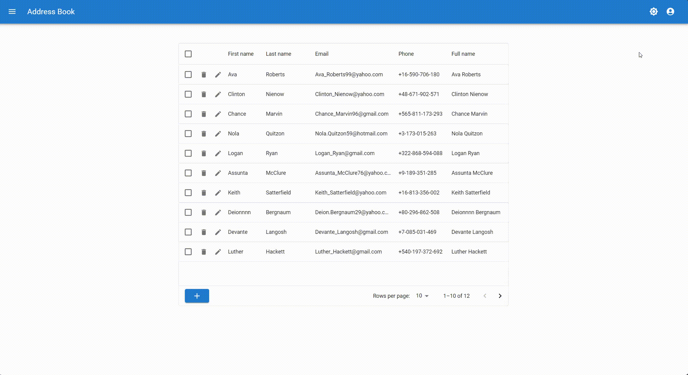

# Address Book

Address Book is a full-stack web application for managing contacts. It provides a user-friendly interface to perform CRUD (Create, Read, Update, Delete) operations on address book entries. The project is built with modern web technologies, including FastAPI for the backend, SQLAlchemy for database management, and React with TypeScript and Material-UI for the frontend.

## Features

- **User-Managed Frontend**: The frontend allows users to fully control and customize their address book entries.
- **Contact Management**: Add, edit, delete, and view contact details.


- **Order and Filtering**: Quickly find contacts using server-side filtering options and order.


- **User Verification**: Simple authentication system to verify users.



- **Settings Management**: Allows users to customize application settings.


- **Responsive Design**: Optimized for various screen sizes.
- **Data Grid Integration**: Utilize Material-UI's DataGrid for efficient data presentation.
- **SQLite Database**: Lightweight and portable database for storing contact information.

## Technologies Used

### Backend
- **FastAPI**: High-performance web framework for the API.
- **SQLAlchemy**: ORM for managing database interactions.
- **SQLite**: Lightweight database for development and testing.

### Frontend
- **React**: Library for building user interfaces.
- **TypeScript**: Adds type safety to JavaScript.
- **Material-UI**: React components for faster and easier web development.
- **MUI DataGrid**: Feature-rich table component for displaying and managing data.

## Usage

### Backend
1. Clone the repository:
   ```bash
   git clone https://github.com/SaharZo321/Address-Book.git
   cd Address-Book/backend
   ```
2. Install dependencies:
   ```bash
   pip install -r requirements.txt
   ```
3. Run the FastAPI server:
   ```bash
   cd ..
   fastapi dev ./backend/src 
   ```

### Frontend
1. Navigate to the frontend directory:
   ```bash
   cd Address-Book/frontend
   ```
2. Install dependencies:
   ```bash
   npm install
   ```
3. Start the development server:
   ```bash
   npm run dev
   ```

### Access the Application
- Open your browser and navigate to `http://localhost:5173` to access the frontend.
- The API documentation is available at `http://localhost:8000/docs`.

---

Enjoy managing your contacts with Address Book!
